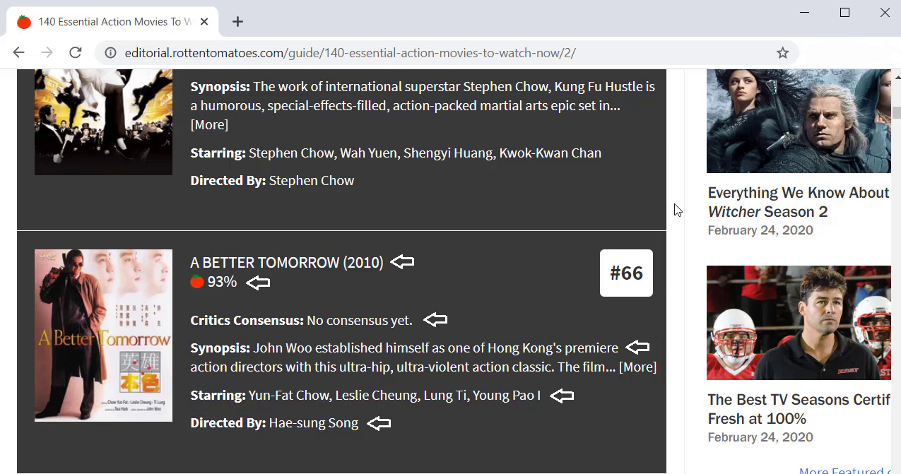
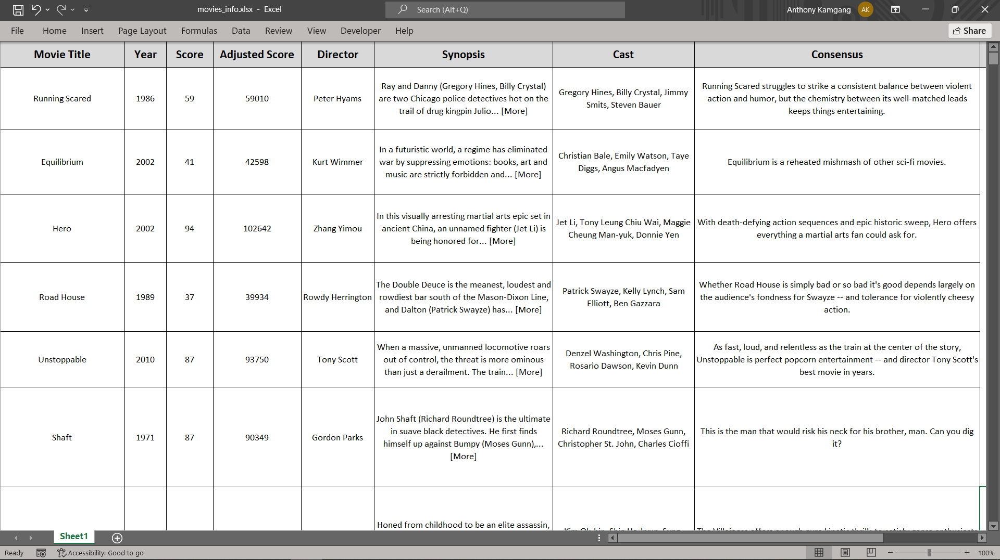

# RottenTomatoes page scraping

* Scraped the website [rottentomatoes](https://editorial.rottentomatoes.com/guide/140-essential-action-movies-to-watch-now/)
* It is a movie review website.
* Scraped it to csv and xlsx format.

**Packages:** requests, urllib, beautifulsoup, pandas

Scraped the following and more:
* **Movie Title**
* **Year** 
* **Score**
* **Adjusted Score**
* **Director**
* **Synopsis**
* **Cast**
* **Consensus**

**We will scrape these for every movie on that page:**

**The results:**
